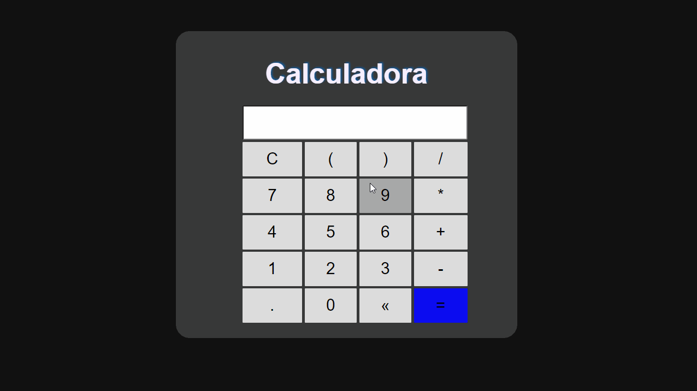

# Calculadora 🖩

> Fiz esta calculadora baseada no exercício do curso *[JavaScript e TypeScript do básico ao avançado](https://www.udemy.com/course/curso-de-javascript-moderno-do-basico-ao-avancado/).*

&nbsp;
## Demonstração 👇

&nbsp;
## O que aprendi 📝
- *[Funções construtoras](https://developer.mozilla.org/pt-PT/docs/Javascript_orientado_a_objetos)* ✔
- *[Função eval()](https://developer.mozilla.org/pt-BR/docs/Web/JavaScript/Reference/Global_Objects/eval)* ✔
- *[Tratamento de erros com try...catch](https://developer.mozilla.org/pt-BR/docs/Web/JavaScript/Reference/Statements/try...catch)* ✔
